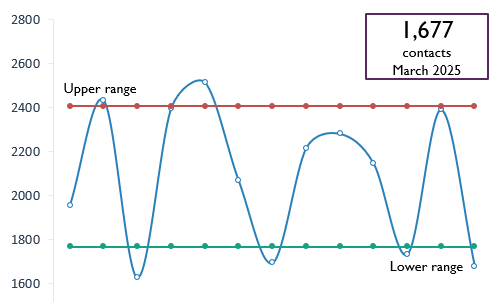
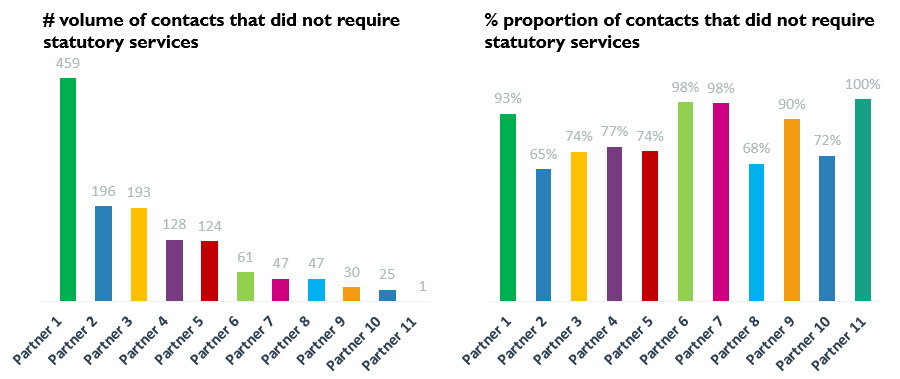
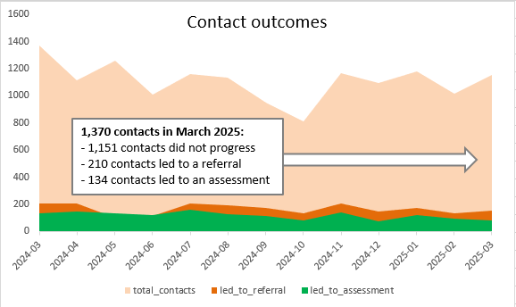

# ReferralPartnerAnalysis

Welcome!

This code was originally developed by [Celine Gross](https://github.com/Cece78), [Chris Owen](https://github.com/chowen94) and [Kaj Siebert](https://github.com/kws) at Social Finance as part of a grant funded programme to support Local Authorities to collaborate on data analysis. The programme was called the ‘Front Door Data Collaboration’. It was supported financially by the Christie Foundation and Nesta (through the ‘What Works Centre for Children’s Social Care’). The LAs whose staff guided its development were Bracknell Forest, West Berkshire, Southampton, and Surrey. It also benefitted from advice from the National Performance and Information Managers Group.

We are happy to share this code hoping that other data analysts may benefit from a quick way to analyse their Annex A returns and get new insights about their Front Door and their referral partners. 

You can find more info about Social Finance Digital Labs on our website: https://www.sfdl.org.uk/

## What's this code about?

**Who is referring the highest volumes to the Front Door, and what are the outcomes of these contacts?**

This is a crucial question for Front Door Heads of Service and Data teams supporting them. This code provides you with a simple yet robust analysis to answer the following questions:
- Across all partners, who is referring the most to the Front Door?
- Across all partners, who is referring cases that result in a referral or an assessment? On the contrary, who is referring cases that do not require statutory support?
- Are there partners referring more or less than what we would expect?
- Overall, how are the Contact, Referral and Assessment trends evolving over time and are they above/below what we would expect?

You can get a glimpse of some suggested analysis further down.

## How to run this programme

### Requirements

To run this programme, you will need to:
- Have installed Python and created a conda environment aligned with [requirements.txt](requirements.txt).
- Have run our Annex A cleaner (steps 10, 20 and optional 30) and Logger (step 50) code to get your Annex A return into a "log" shape suitable for analysis. This code can be found in the StatutoryDataCleaner repository. **We advise that you create a log of at least one year of Annex A data to get a meaningful analysis over time.**

### How to: code

Once that is done, open the referral-partner-analysis notebook and follow the steps detailed below:
1. **Input required**: define the filepaths to the log and to the folder in which the output of the analysis will be downloaded
2. **Input required**: define the date at which the report should end and the analysis window (in months - we suggest at least 12 months)
3. Run the rest of the notebook
4. Find the resulting Excel spreadsheet in your output folder

You're done!

### How to: further analysis

You can use the Excel spreadsheet to visualise Front Door trends. Here are a few suggestions:

"Comparative contacts" tab:

Interpretation: The number of contacts in March 2025 have gone down and are lower than what we would expect based on the standard deviation of the past 12 months. **Did something out of the ordinary happen this month? Is this the result of a better understanding of thresholds?**
*This analysis can also be done for referrals ("Comparative referrals" tab) and assessment starts ("Comparative assessments" tab).*

"NFA contacts" tab:

Interpretation: Partner 1 is by far referring the highest volume of contacts that did not require statutory services (did not progress to referral). However, other partners are referring more contacts that do not require statutory services in relative terms, e.g. Partner 6 and Partner 7 (98%) and Partner 11 (100%). **Looking at both volume and proportion could inform discussions around thresholds with referral partners who are referring contacts that do not require statutory services.**

"Total" tab:

Interpretation: The huge majority of contacts this month (and previous months) did not lead to a referral. Only less than 10% of contacts result in an assessment. **There may be potential to reduce unnecessary contacts that are taking up most of the Front Door's team time.**
*This analysis can also be done for each referral partner, focusing on their contacts, referrals and assessments only (partner tabs).*

## Assumptions and caveats

**Log data** - We are assuming that users have run their Annex A files through our Annex A cleaner and our Log code. This is to ensure typos in column names or in data fields are identified and standardized before we start the analysis.

**Clean data** - The analysis is only as good as the data it is based on. Although running your Annex A data through the Annex A cleaner and Log code might improve its quality, there is a risk that missing and/or incorrect data could get in the way of the analysis (in particular for the events matching process described below).

**Events matching** - This analysis defines whether each contact led to a referral and an assessment start. To do so, we are matching "contact" events (Annex A List 1) to "referral" events (Annex A List 3) and "assessment start" events (Annex A List 4). The matching process may imply some data getting lost:
- **A contact will be matched to a referral if**
1) The contact and the referral have the same Child Unique ID
2) The referral is the next event happening directly after the contact (e.g. there is no other event in between)
3) The contact and the referral have the same contact source

**Implications**: A referral must be matched to a contact. If a referral cannot be matched to a contact, it won't be counted at all. There is a possibility that referrals that were not correctly recorded (e.g. wrong contact source) or that do not come after a contact might not be accounted for.
- **A referral will be matched to an assessment start if**
1) The referral and the assessment start have the same Child Unique ID
2) The assessment start happens within 7 days of the referral.

**Implications**: An assessment must be matched to a referral to be counted. This is a good proxy to only count single assessments: Annex A List 4 also records assessments on open cases by the Long Term team, but these assessments do not come after a referral so we are not matching them nor counting them in our analysis. However, if a regular single assessment was to happen without a previous referral, it wouldn't be counted.
      

## Contributing

We'd be very happy for you to contribute! Head over to [CONTRIBUTING.md](CONTRIBUTING.md) for more information.
